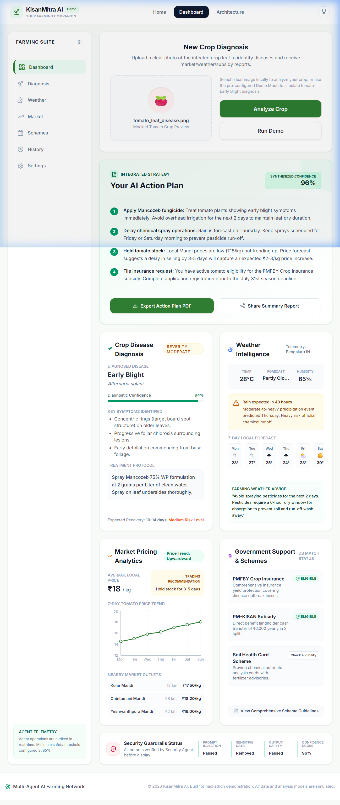
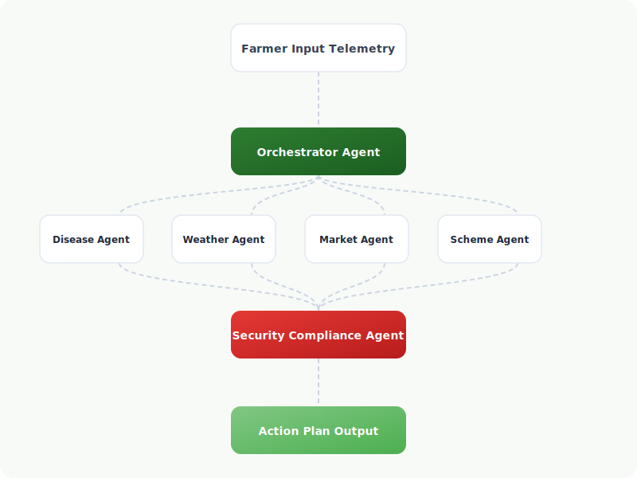
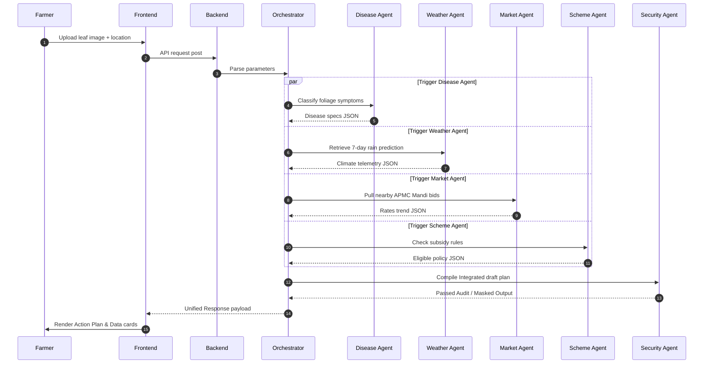

# KisanMitra AI — "Your Intelligent Farming Companion"

[](https://opensource.org/licenses/MIT)
[](https://github.com/kisanmitra-ai/kisanmitra-ai/actions)
[](https://fastapi.tiangolo.com)
[](https://react.dev)

🌾 **KisanMitra AI** is a production-ready, secure, Multi-Agent AI platform designed to empower smallholder farmers by consolidating fragmented agricultural advice into a single, context-aware Action Plan.

Our platform coordinates specialized sub-processes to classify crop diseases, fetch hyperlocal weather telemetry, gather APMC market pricing, and match government welfare schemes in parallel, using strict output security guardrails.

---

## 🎨 Project Demo Preview

> [!NOTE]
> *Screenshots and demo animation files are located under `/screenshots/` and `/demo/` folders.*

| Application Dashboard (Mock) | Multi-Agent Architecture (SVG Flow) |
| :---: | :---: |
|  |  |

---

## ⚙️ Core Features

- 🌿 **Crop Disease Diagnosis**: Computer vision leaf classifiers specifying early blight/late blight details.
- 🌦 **Weather Intelligence**: 7-day weather telemetry warning farmers of rainfall windows and pesticide wash-off risks.
- 📈 **Mandi Pricing Feeds**: APMC mandi comparison listings with 7-day tomato predictive pricing trends.
- 🏛 **Welfare Matching**: Automated checks for PMFBY insurance and state direct subsidies.
- 🧠 **Cognitive Orchestrator**: Aggregates sub-agent JSON recommendations into a structured, numbered 4-step Action Plan.
- 🛡 **Security Guardrails**: Checks inputs for prompt injections, masks PII, and validates safety thresholds before output.

---

## 🛠 Tech Stack

- **Frontend**: React (Functional Hooks), Tailwind CSS v4, Framer Motion (Transitions), Recharts (Graphs), Lucide React (Icons).
- **Backend**: FastAPI (Python ASGI), Pydantic (Validation & Schemas), Uvicorn.
- **AI Core (Conceptual)**: Google ADK (Agent Development Kit), Gemini 1.5 Pro/Flash, MCP (Model Context Protocol).

---

## 🧬 System Architecture & Flow

KisanMitra AI utilizes an orchestrator-agent layout. Workloads are parallelized asynchronously to optimize API latency:



---

## 🚀 Quick Start & Installation

To run KisanMitra AI locally, refer to the following guides:
1. **Frontend Instructions**: See [frontend/README.md](frontend/README.md) (or root guides below)
2. **Backend Instructions**: See [backend/README.md](backend/README.md)
3. **Full Developer Setup**: See [docs/developer_guide.md](docs/developer_guide.md)

### Running Frontend
```bash
cd frontend
npm install
npm run dev
```

### Running Backend
```bash
cd backend
python -m venv venv
# Activate virtual environment
source venv/bin/activate  # Windows: venv\Scripts\activate
pip install -r requirements.txt
python main.py
```

---

## 🗺 Future Roadmap
- [ ] Connect live Google Gemini API endpoints using Google ADK templates.
- [ ] Incorporate WhatsApp & SMS alerts via Twilio for offline farmers.
- [ ] Integrate live Model Context Protocol (MCP) servers for geo-spatial soil lookups.
- [ ] Support localization in 10+ regional languages.

---

## ⚖️ License
Distributed under the MIT License. See [LICENSE](LICENSE) for more details.

---

## 🤝 Acknowledgements
- **Google ADK**: For modular agent lifecycle building blocks.
- **Gemini**: High-context vision-language reasoning models.
- **Model Context Protocol (MCP)**: Open protocol for connecting clients to servers.
- **FastAPI** & **React** communities.
