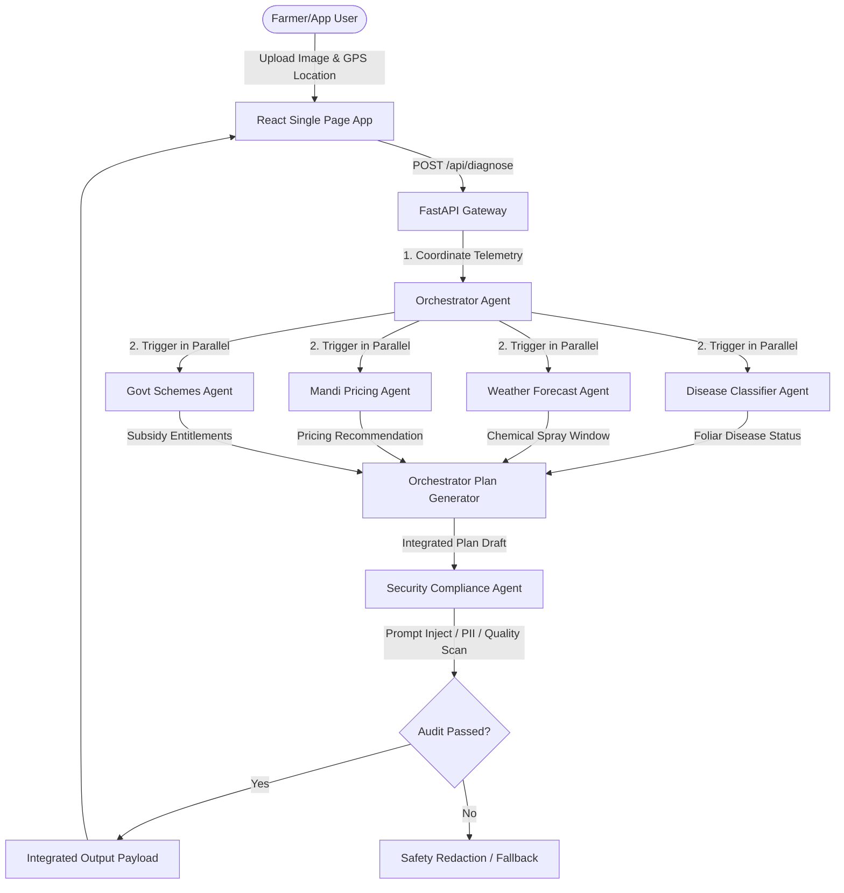

# Architecture Documentation - KisanMitra AI

KisanMitra AI utilizes a secure Multi-Agent Orchestration architecture designed to process agricultural queries and telemetry in parallel, compile localized recommendations, and audit all outputs against safety constraints.

## System Topology

---

## Key Core Components

### 1. Gateway Routing (FastAPI)
The entry point handles REST networking, incoming file deserialization, file streaming validations, and cors mappings.

### 2. Cognitive Orchestrator
The Orchestrator determines which agent nodes need to be queried. It handles:
- Schema parameters generation.
- Spawning asynchronous tasks for parallel sub-processes.
- Compiling diverse inputs (leaf health classifier, weather risk metrics, APMC pricing trends) into a unified Markdown/JSON Action Plan.

### 3. Sub-Agent Network
- **Disease Classifier Agent**: Runs image-based vision LLM processes.
- **Weather Forecast Agent**: Pulls station weather metrics and checks humidity limits for spray advice.
- **Market Agent**: Compiles mandi price trends and estimates bid recommendations.
- **Scheme Agent**: Cross-references local eligibility criteria against farmer land holdings databases.

### 4. Security guardrail agent (Llama Guard / PII Redactors)
The security layer performs checks before formatting results:
- Prompt injection checks to verify input sanitization.
- Sensitive data masks to redact personal land record coordinates or user names.
- Output toxicity audits.
- Confidence validation (ensuring model evaluations are above 85%).
